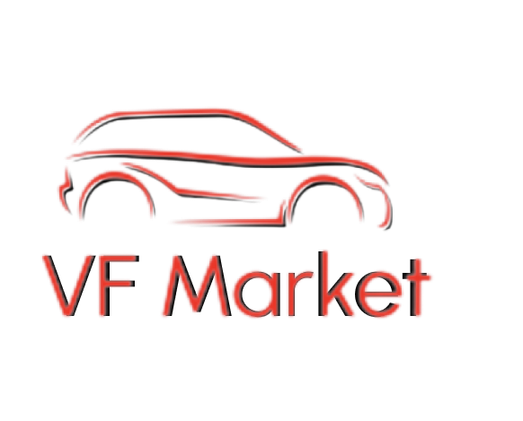
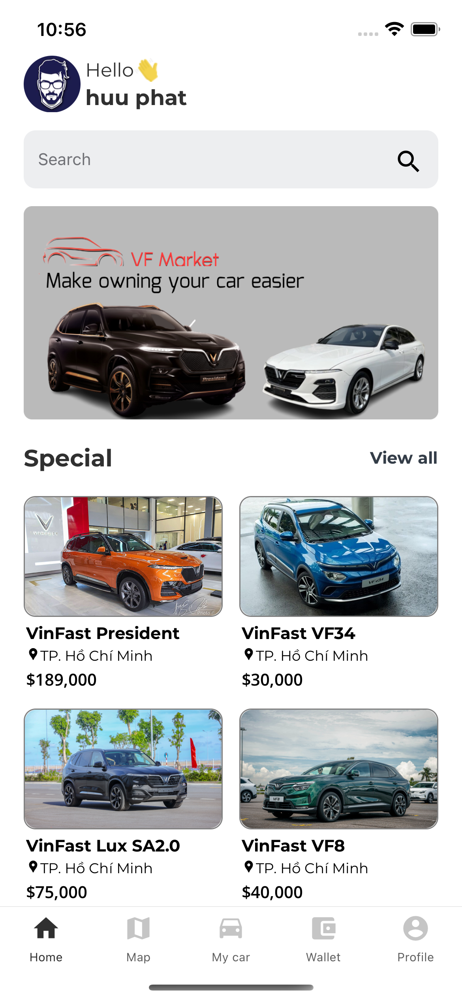
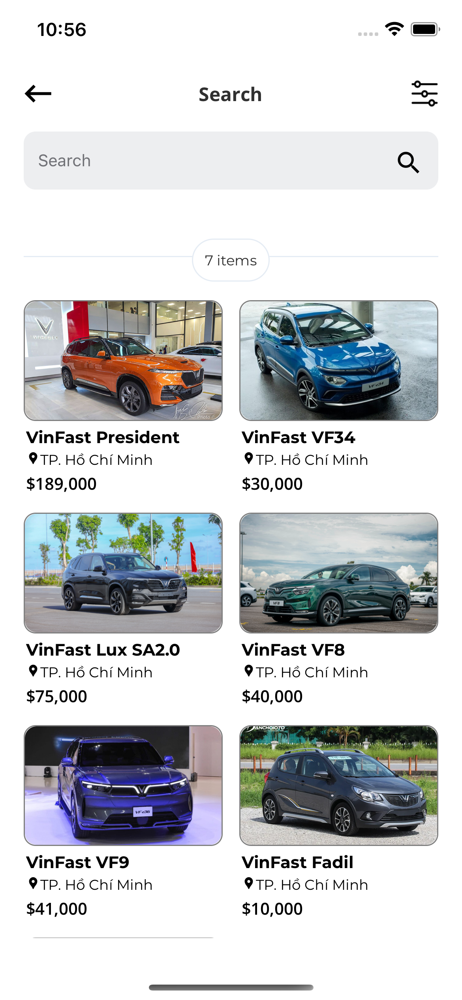
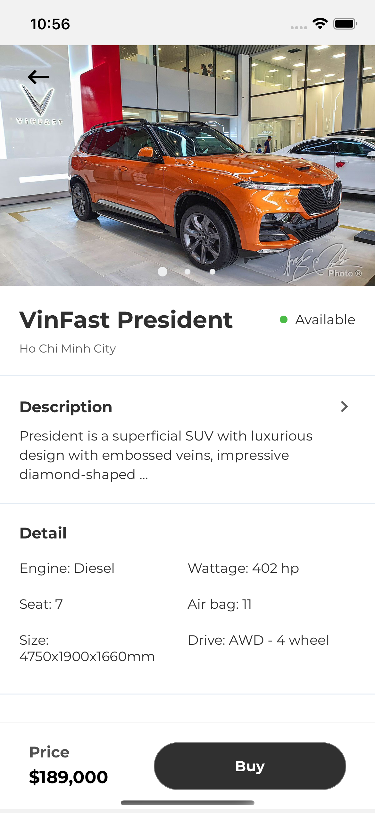
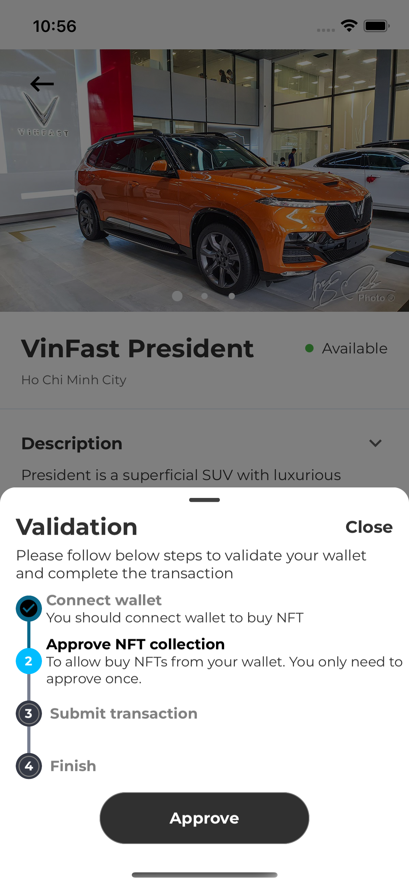
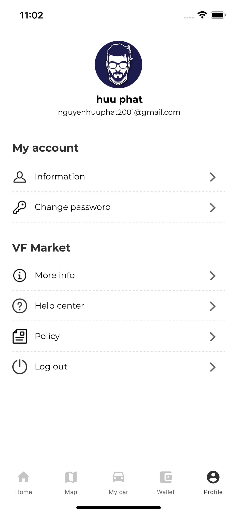

# VF Market

## Table of Contents

- [Introduction](#introduction)
- [Video Demo](#video-demo)
- [Technologies Used](#technologies-used)
- [Features](#features)
- [How to install and run the project](#how-to-install-and-run-the-project)
- [Team](#team)

## Introduction

VF Market is a mobile application allow user buy car.Every car has a nft used to prove ownership of user. User can use wallet in app to buy nft. This application is integrated with Backend [VF Market BE](https://github.com/LucasTran-tq/VF-market-be).






## Video Demo

You can have a look with VF Market through [the video](https://www.youtube.com/watch?v=x8MMWW4ODuo).

## Technologies Used

VF Market should use the following technologies, frameworks and development techniques:

- [React Native](https://reactnative.dev)
- [Redux thunk](https://redux.js.org)
- [Web3Js](https://web3js.readthedocs.io)

## Features

A few of the things you can do with VF Market:

- Sign up
- Sign in
- View all products
- Search
- Create wallet
- Import wallet
- Read contract
- Write contract

## How to install and run the project

To clone and run this application, you'll need [yarn](https://yarnpkg.com), [NodeJs](https://nodejs.org/en/) and [Visual Studio](https://visualstudio.microsoft.com/) installed on your computer.

```
- Install package
yarn
```

```
- Run android
yarn android
```

```
- Run ios
yarn pod
yarn ios
```

## Team

- [Tran Quoc Thang](https://github.com/LucasTran-tq)
- [Nguyen Huu Phat](https://github.com/nguyenhuuphat2001)

